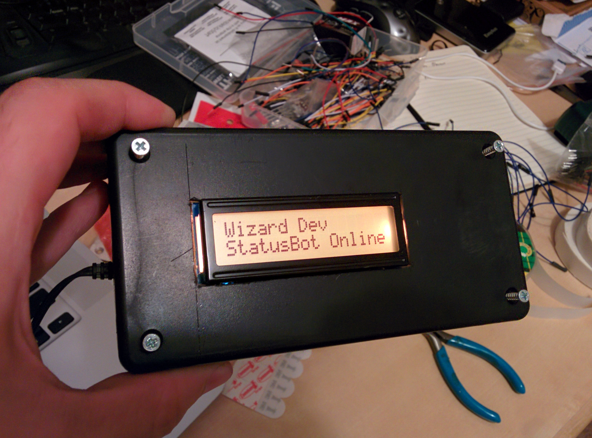
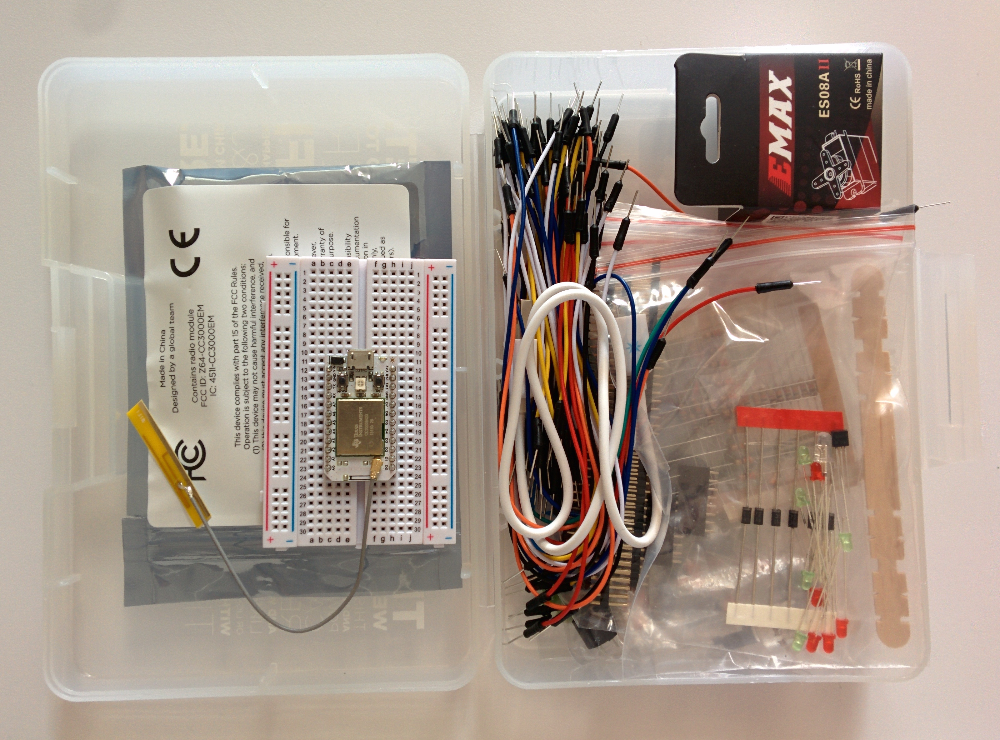
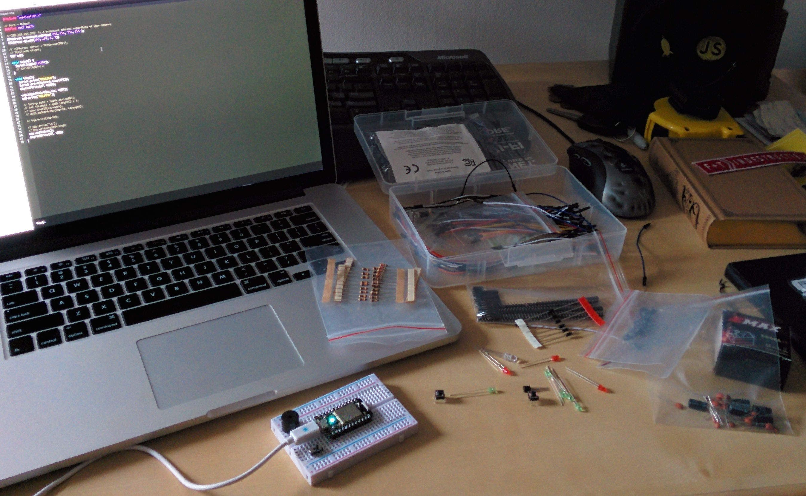
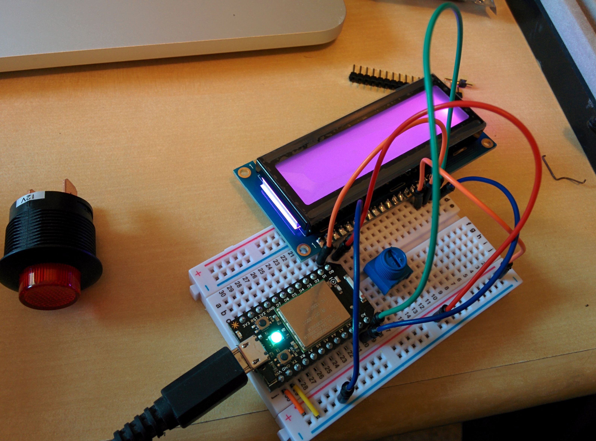
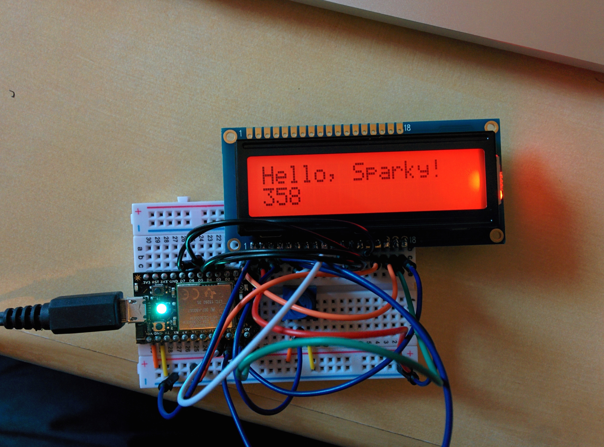
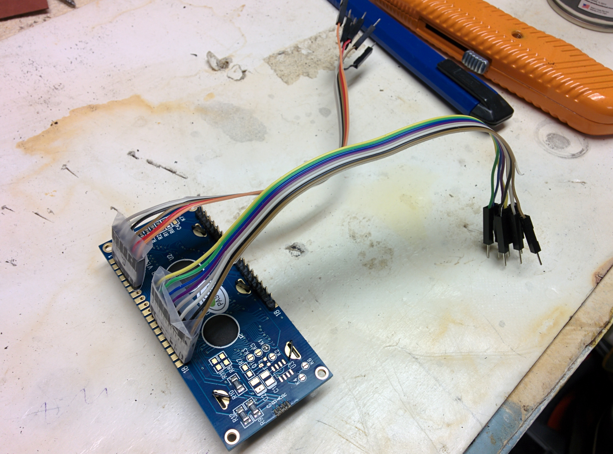
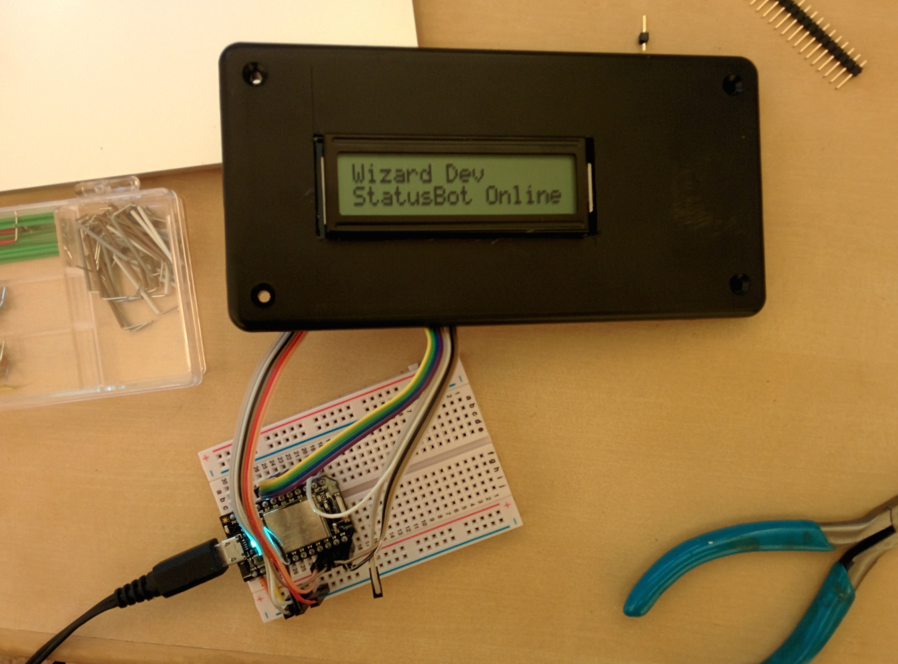
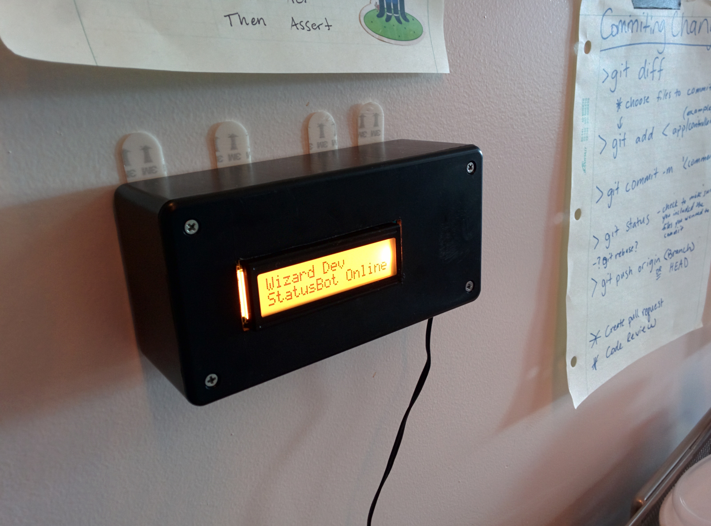

# Wizard Development StatusBot

[](https://greenkeeper.io/)

Any sufficiently mature development team eventually has someone who makes a build status indicator. This one is ours.



The WizardDev StatusBot shows us the current status of the latest build, the repo and branch names, and the commit message. We have it on our wall and can glance at it whenever we're curious.

Today I'll take you through my build processes and how I figured out the different components to build our status bot.

# What does the Status Bot do?

First [A little video on how it all works.](https://www.youtube.com/watch?v=16FB0OINGTk&feature=youtu.be)

In software development its a best practice to write tests that make sure your program does what you think it does. These tests even go a bit further and ensure that you don't accidentally break anything that used to work. Most projects have what's called a CI server or "Continuous integration" server. Every time someone makes something new for the project they push their code to github which triggers our CI server to run all the tests and advertise if the changes fail any tests.

While you'll usually find our [favorite build server](https://circleci.com) open in another tab in our browsers
unless we're waiting on it, it's never the active tab. The status bot has 3 components that work together to show us the current status of the latest run of our test suite. With a little bit of background of what was changed.

# How it works

I'll split the build into three parts.

1. The Hardware
2. The Firmware
3. The Software

These three parts all work together to take information from our build servers communicate it over the interner securly to the bot on our wall.

# The Hardware

At this years [JSConf](http://2014.jsconf.us/) everyone in attendance got a [SparkCore Maker Kit](http://docs.spark.io/shields/#spark-maker-kit). This kit had a SparkCore, breadboard, leds, wires, servos, etc. An awesome starting point for playing with their hardware. After spending a few days helping hundreds of other people use the sparkcore at JSConf's nodebot event, I decided I wanted to use one in a build of my own.


<!--  -->

The original plan was to have an led change color. The kit comes with a [tri color LED](http://docs.spark.io/shields/#setting-up-the-shield-5-rgb-led-1) and when loaded with the sparkcore's default tinker firmware you can fairly easily turn on and off the red green and blue colors inside the LED.

I played with this for a little while and was able to set the color from both the android app and from my computer by hitting the SparkCloud rest api. The SparkCloud api allows you to securely call functions from the sparkcore's firmware via the net.

The light worked but wasn't enough. I wanted more.

A display is what I wanted! And luckily I had an [Adafruit 16x2 LCD with RGB backlight](http://www.adafruit.com/products/398?&main_page=product_info&products_id=398) laying around begging to be used. It's only $13 and only uses 6 pins on your microcontroller. (A lot more then the slightly more expensive serial or I2C displays which only need 1 pin, but I had the pins to spare, and more importantly I had the LCD in my posesion!)

Adafruit's [Learning Center](https://learn.adafruit.com/character-lcds) is great and I used their guides to setup the pins, and load the libraries for my firmware. The image above shows the me testing the RGB colors before I hooked up the signal wires to actually write on the display. That dial you see is to adjust the contrast. In the final build I was able to just hook it directly to ground as my display seemed to work best with full contract, this varies between parts and you may not be able to get away with that.

I ran over to RadioShack and was pleasantly surprised to find a project enclosure for a few dollars. If I had prepared more I would have gotten something nicer from Adafruit but you work with what you have.

While I was there I got that big red button you see. It lights up. I really wanted to use it but it didn't make it in this build. Maybe I'll get to add it to the build the next time I do upgrades. I'm of the opinion that a big red button that does something is worth a lot.

I eventually got everything hooked up and did a character test with some custom firmware. I also took a [little video](https://vine.co/v/MPalDZFdlrt)



Since the breadboard was a little cramped and would make mounting the LCD difficult I soldered in the wires directly. The LCD's dual headers (two places to hook up the same wires) helped a ton for this. I taped up the wires to make it easy to solder and then went to work.



Cutting the plastic to fit the screen was difficult. I used a box cutter and few metal files. It took forever! Further research informed me that a hair dryer to heat up the plastic would have made a world of difference. Double sided foam tape holds the display in place. I think hot glue might be a good upgrade. In any case, I'm very happy with the result.



I drilled a hole in the side of the box for power and I was done with the hardware!


## Parts

1. [SparkCore](http://docs.spark.io/hardware/)
2. [RGB backlight positive LCD 16x2 +extras](http://www.adafruit.com/products/398?&main_page=product_info&products_id=398)
3. [RadioShack 6x4x2 Enclosure](http://www.radioshack.com/product/index.jsp?productId=2062283) more at  [Adafruit's Enclosures](https://www.adafruit.com/categories/208)
4. [Hookup Wires](https://www.adafruit.com/products/758)


# Firmware
I built all three components at the same time. The firmware progressed as the hardware went from a blinking light to an RGB display. However the goals were the same. I wanted to expose simple functions to product a desireable action not expose the internals of how the hardware works.

This meant exposing (to the Spark Cloud) functions to change the color and set the messages

```c++
Spark.function("backlight", netBacklight);
Spark.function("testLight", testBacklight);
Spark.function("printLCD", printLCD);
```

These three functions take a string as an argument and I do the magic to make the hardware work. `backlight(String "HEXCOLORCODE")` takes a string of HEX in our classic RGB color code. `#FFFFFF` for white, `FF3f00` for "wizard orange" etc. Converts it to an unsigned long integer and then breaks it out into the three color codes one for each channel of the displays backlight.

```c++

oid backlight(unsigned long rgb) {
  int r = rgb >> 16 & 0x0000FF;
  int g = rgb >> 8 & 0x0000FF;
  int b = rgb & 0x0000FF;

  r = map(r, 0, 255, 0, brightness);
  g = map(g, 0, 255, 0, brightness);
  b = map(b, 0, 255, 0, brightness);

  // common anode so invert!
  r = map(r, 0, 255, 255, 0);
  g = map(g, 0, 255, 255, 0);
  b = map(b, 0, 255, 255, 0);

  analogWrite(R_PIN, r);
  analogWrite(G_PIN, g);
  analogWrite(B_PIN, b);
}
```
Writing the display is done with `PrintLCD(String "MESSAGE")` and it takes a two line, 16 characters per line, string and writes it to the display. Furutre versions should have scrolling text which the `LiquidCrystal` library fully supports. But 16 chars are all we get for now.

I missed features of higher level languages like `String.split` having a generic number type. However it was worth the pain to do this stuff on the SparkCore so we could have an easy to use and clean api.

The `testBacklight` function ignores it's argument and just cycles the backlight colors on the display. I like to make it dance from my phone for fun.

You can see all the details in the `statusbot.ino` [file in the source](https://github.com/wizarddevelopment/statusbot/blob/master/statusbot.ino)!

# Software
I'm a big fan of continuous deployments and both circleci and heroku make that easy. So I used heroku to host the server component of statusbot. It's broken down into modules that provide middleware for express.js to handle incoming data, and another module used by anything to update the display. There's some unfinished github integration code that I ended up not using. (I went with circle's api in the end even though github's build notifications would work with any CI server. It was just easier to use upfront.)

The only route that's not middleware is the `/test` route. This calls `spark.testBacklight()` which calls the firmwares's `testBacklight` which makes the LCD dance. [Video of the dance.](https://vine.co/v/MPWQ9txOWje
)

```js
var circleNotifier = require('./circle');
var SparkStatus = require('./spark');

// later

app.use('/test', function(req,res,next){
  console.log(req);
  var ip = req.headers['x-forwarded-for'] || req.connection.remoteAddress;
  spark.write("Testing from:\n" + ip, function(err, retval){
    res.end(JSON.stringify({err: err, retval: retval}));
  });
  spark.testBacklight();
});

```

I call `testBacklight` outside of the request/response cycle because it takes a while to respond, which only occures after it's done testing the backlight.

The real magic is the `spark.js` `buildStatus()` function. Which takes a javascript object of build data (as subset of both circle's and github's returned information) and updates the display accordingly.

```js
// Wizard Development would like to remind you there is no such thing as magic.

SparkStatus.prototype.buildStatus = function(build) {
  if (build.success) {
    this.backlight("00FF00");
    this.write(build.repo + "/" + build.branch + "\n" + build.commit_msg);
    return;
  }
  this.backlight("FF0000");
  this.write(build.repo + "/" + build.branch + "\n" + build.commit_msg);
};
```


# Done!


